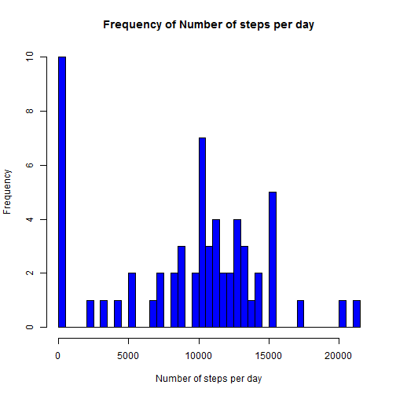
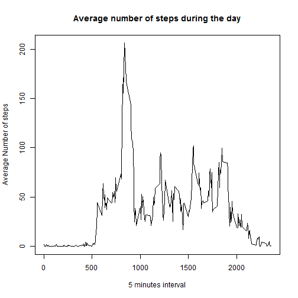
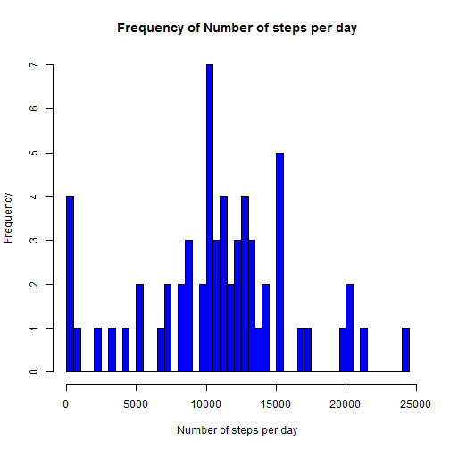
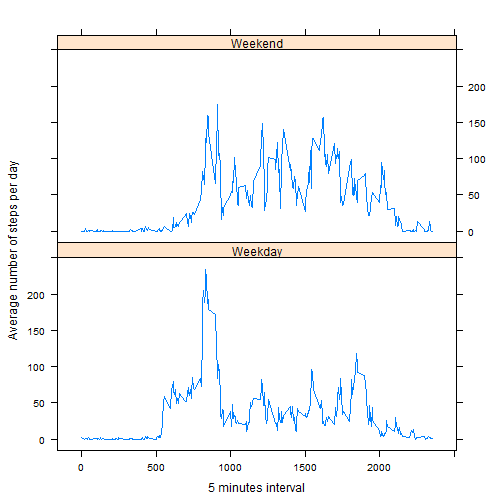

Reproducible Research - Assignment 1
========================================================

*Note: I am also using inline code.*

Loading and preprocessing the data
-------------------------------------------------------------------------


```r
Activity<-read.csv('activity.csv',colClasses = c("integer","Date","integer"))
```


What is mean total number of steps taken per day?
-------------------------------------------------------------------------

I use plyr library.


```r
library(plyr)
TotalPerDay<-ddply(Activity,.(date),summarize,sum=sum(steps,na.rm=TRUE))
hist(TotalPerDay$sum,col="blue",xlab="Number of steps per day",main="Frequency of Number of steps per day",breaks=50)
```

 

```r
summaryTotal<-summary(TotalPerDay$sum)
```

The mean total per day is **9350** and the median is **1.04 &times; 10<sup>4</sup>**.  

What is the average daily activity pattern?
-------------------------------------------------------------------------


```r
AverageduringDay<-ddply(Activity,.(interval),summarize,Average=mean(steps,na.rm=TRUE))
plot(AverageduringDay$interval,AverageduringDay$Average,type="l",xlab="5 minutes interval",ylab="Average Number of steps",main="Average number of steps during the day")
```

 

```r
AverageduringDay[which.max(AverageduringDay$Average),1]
```

```
## [1] 835
```

The maximum average during the day is during the interval: **835**.


Imputing missing values
-------------------------------------------------------------------------

```r
sum(is.na(Activity$steps))
```

```
## [1] 2304
```

1. There are 2304 NAs in the dataset.

2. My strategy is to used the mean for that 5-minute interval. To do so I will used the same kind pf dataset as above but expanded for each day/interval.

3. Create the new dataset

```r
AverageduringDay2<-ddply(Activity,.(interval),summarize,Average=ave(steps,FUN=function(x) mean(x,na.rm=TRUE)))
ActivityFilled<-data.frame(steps=ifelse(is.na(Activity$steps),AverageduringDay2$Average,Activity$steps),date=Activity$date,interval=Activity$interval)
TotalPerDayFilled<-ddply(ActivityFilled,.(date),summarize,sum=sum(steps,na.rm=TRUE))
hist(TotalPerDayFilled$sum,col="blue",xlab="Number of steps per day",main="Frequency of Number of steps per day",breaks=50)
```

 

```r
summaryTotalFilled<-summary(TotalPerDayFilled$sum)
```

The mean total per day is **1.09 &times; 10<sup>4</sup>** and the median is **1.1 &times; 10<sup>4</sup>**, both are HIGHER than the values for the NAs-included dataset.


Are there differences in activity patterns between weekdays and weekends?
-------------------------------------------------------------------------

1. For splitting between Weekday and weekend, I will do a first factorization with the weekday function then a second factorization on the latter level.


```r
factor1<-factor(weekdays(Activity$date),levels=c("Monday","Tuesday","Wednesday","Thursday","Friday","Saturday","Sunday"))
factor2<-factor(ifelse(unclass(factor1)<6,"Weekday","Weekend"))
ActivityPerDayType<-data.frame(steps=Activity$steps,date=Activity$date,interval=Activity$interval,DayLevel=factor2)
```

2. Plotting

```r
library(lattice)
AverageduringDayType<-ddply(ActivityPerDayType,.(DayLevel,interval),summarize,Average=mean(steps,na.rm=TRUE))
xyplot(AverageduringDayType$Average~AverageduringDayType$interval|AverageduringDayType$DayLevel,layout=c(1,2),type="l",ylab="Average number of steps per day",xlab="5 minutes interval")
```

 
